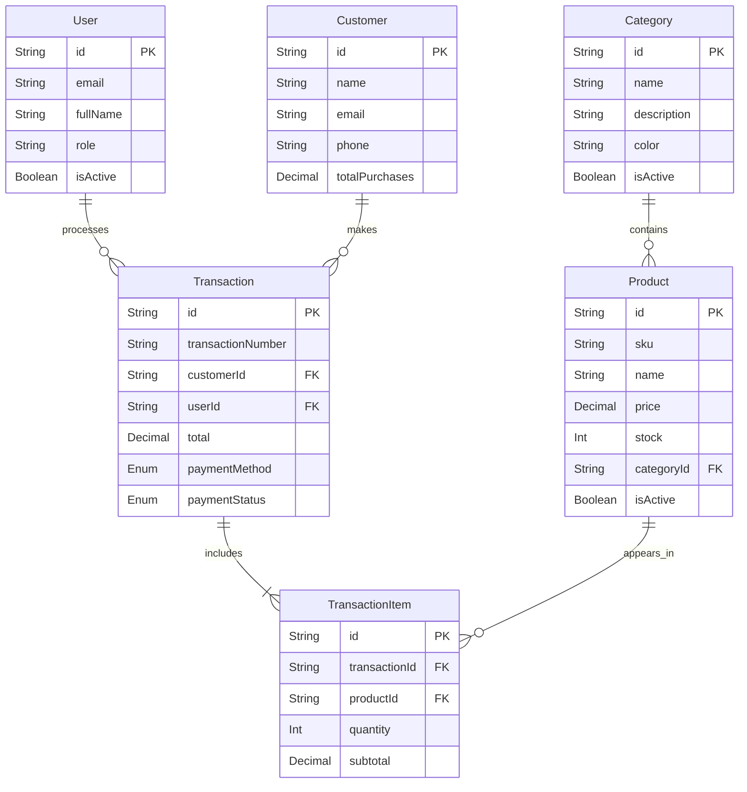

# Dokumentasi Database SmartPOS

Dokumentasi ini menjelaskan struktur database yang digunakan dalam aplikasi SmartPOS. Aplikasi ini menggunakan **PostgreSQL** sebagai sistem manajemen basis data relasional (RDBMS) dan **Prisma ORM** untuk interaksi database.

## Ringkasan

-   **Database Engine**: PostgreSQL
-   **ORM**: Prisma
-   **Skema**: Relational (SQL)

## Entity Relationship Diagram (ERD)

Diagram berikut menggambarkan hubungan antar entitas dalam database.

## Detail Tabel (Schema)

Berikut adalah detail kolom dan tipe data untuk setiap tabel.

### 1. User (`users`)
Menyimpan data pengguna aplikasi (Admin, Manager, Kasir).

| Kolom | Tipe Data | Deskripsi | Constraint |
| :--- | :--- | :--- | :--- |
| `id` | String (UUID) | Primary Key | `@id`, `@default(uuid())` |
| `email` | String | Email pengguna untuk login | `@unique` |
| `passwordHash` | String | Password yang sudah di-hash (bcrypt) | `@map("password_hash")` |
| `fullName` | String | Nama lengkap pengguna | `@map("full_name")` |
| `role` | String | Peran pengguna (admin, staff, etc) | Default: "admin" |
| `isActive` | Boolean | Status aktif akun | Default: `true` |
| `lastLogin` | DateTime | Waktu terakhir login | Optional |
| `createdAt` | DateTime | Waktu pembuatan akun | `@default(now())` |
| `updatedAt` | DateTime | Waktu update terakhir | `@updatedAt` |

### 2. Category (`categories`)
Mengelompokkan produk ke dalam kategori.

| Kolom | Tipe Data | Deskripsi | Constraint |
| :--- | :--- | :--- | :--- |
| `id` | String (UUID) | Primary Key | `@id`, `@default(uuid())` |
| `name` | String | Nama kategori | `@unique` |
| `description` | String | Deskripsi kategori | Optional |
| `icon` | String | Nama ikon (Lucide React) | Optional |
| `color` | String | Kode warna Hex | Optional |
| `isActive` | Boolean | Status aktif kategori | Default: `true` |

### 3. Product (`products`)
Menyimpan inventaris barang yang dijual.

| Kolom | Tipe Data | Deskripsi | Constraint |
| :--- | :--- | :--- | :--- |
| `id` | String (UUID) | Primary Key | `@id`, `@default(uuid())` |
| `categoryId` | String (UUID) | Foreign Key ke Category | `@map("category_id")` |
| `name` | String | Nama produk | |
| `sku` | String | Stock Keeping Unit (Kode unik) | `@unique` |
| `price` | Decimal(12, 2) | Harga jual satuan | |
| `cost` | Decimal(12, 2) | Harga modal (HPP) | Optional |
| `stock` | Integer | Jumlah stok saat ini | Default: 0 |
| `minStock` | Integer | Batas stok minimum untuk alert | Default: 5 |
| `imageUrl` | String | URL gambar produk | Optional |
| `barcode` | String | Kode barcode | Optional |
| `isActive` | Boolean | Status produk (dijual/tidak) | Default: `true` |

### 4. Customer (`customers`)
Menyimpan data pelanggan.

| Kolom | Tipe Data | Deskripsi | Constraint |
| :--- | :--- | :--- | :--- |
| `id` | String (UUID) | Primary Key | `@id`, `@default(uuid())` |
| `name` | String | Nama pelanggan | |
| `email` | String | Email pelanggan | Optional, `@unique` |
| `phone` | String | Nomor telepon | Optional |
| `address` | String | Alamat pelanggan | Optional |
| `totalPurchases` | Decimal(12, 2) | Total nilai belanja seumur hidup | Default: 0 |
| `isActive` | Boolean | Status aktif | Default: `true` |

### 5. Transaction (`transactions`)
Mencatat header transaksi penjualan (struk).

| Kolom | Tipe Data | Deskripsi | Constraint |
| :--- | :--- | :--- | :--- |
| `id` | String (UUID) | Primary Key | `@id`, `@default(uuid())` |
| `transactionNumber` | String | Nomor unik struk (mis: TRX-2023...) | `@unique` |
| `customerId` | String (UUID) | Foreign Key ke Customer | Optional |
| `userId` | String (UUID) | Foreign Key ke User (Kasir) | |
| `subtotal` | Decimal(12, 2) | Total harga sebelum diskon/pajak | |
| `tax` | Decimal(12, 2) | Nilai pajak | Default: 0 |
| `discount` | Decimal(12, 2) | Nilai diskon | Default: 0 |
| `total` | Decimal(12, 2) | Total bayar akhir | |
| `paymentMethod` | Enum | Metode pembayaran | Default: `cash` |
| `paymentStatus` | Enum | Status pembayaran | Default: `paid` |
| `notes` | String | Catatan tambahan | Optional |
| `createdAt` | DateTime | Waktu transaksi | `@default(now())` |

### 6. TransactionItem (`transaction_items`)
Mencatat detail barang yang dibeli dalam satu transaksi.

| Kolom | Tipe Data | Deskripsi | Constraint |
| :--- | :--- | :--- | :--- |
| `id` | String (UUID) | Primary Key | `@id`, `@default(uuid())` |
| `transactionId` | String (UUID) | Foreign Key ke Transaction | |
| `productId` | String (UUID) | Foreign Key ke Product | |
| `productName` | String | Snapshot nama produk saat transaksi | |
| `productSku` | String | Snapshot SKU produk saat transaksi | |
| `quantity` | Integer | Jumlah barang dibeli | |
| `unitPrice` | Decimal(10, 2) | Harga satuan saat transaksi | |
| `subtotal` | Decimal(12, 2) | Total harga baris ini (qty * price) | |

*Catatan: `productName`, `productSku`, dan `unitPrice` disimpan sebagai snapshot agar riwayat transaksi tidak berubah meskipun data master produk diupdate di masa depan.*

## Enum

### PaymentMethod
Daftar metode pembayaran yang didukung.
-   `cash`
-   `debit_card`
-   `credit_card`
-   `digital_wallet`
-   `bank_transfer`

### PaymentStatus
Status dari sebuah transaksi.
-   `pending`: Menunggu pembayaran
-   `paid`: Lunas
-   `refunded`: Dikembalikan
-   `cancelled`: Dibatalkan

## Relasi Antar Tabel

1.  **Category -> Product (One-to-Many)**
    -   Satu kategori bisa memiliki banyak produk.
    -   Satu produk hanya memiliki satu kategori.
    -   *OnDelete: Cascade* (Menghapus kategori akan menghapus produk di dalamnya).

2.  **Product -> TransactionItem (One-to-Many)**
    -   Satu produk bisa muncul di banyak item transaksi.

3.  **Transaction -> TransactionItem (One-to-Many)**
    -   Satu transaksi terdiri dari banyak item baris.
    -   *OnDelete: Cascade* (Menghapus transaksi akan menghapus detail itemnya).

4.  **User -> Transaction (One-to-Many)**
    -   Satu user (kasir) bisa memproses banyak transaksi.

5.  **Customer -> Transaction (One-to-Many)**
    -   Satu pelanggan bisa melakukan banyak transaksi.
    -   *OnDelete: SetNull* (Menghapus pelanggan tidak akan menghapus riwayat transaksinya, hanya kolom `customerId` menjadi null).
